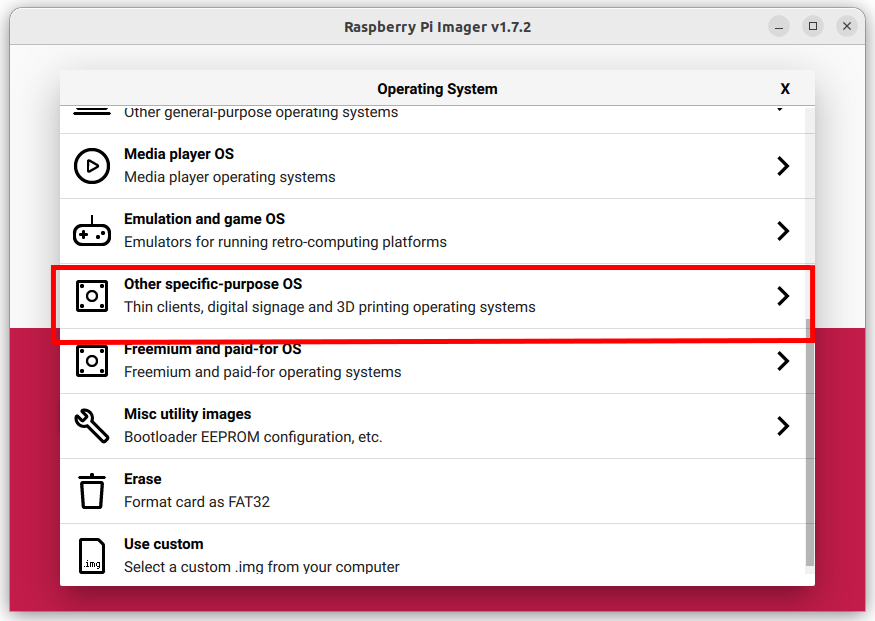

# Anthias - Digital Signage for the Raspberry Pi
[](https://github.com/Screenly/Anthias/actions/workflows/docker-test.yaml)
[](https://github.com/Screenly/Anthias/actions/workflows/codeql-analysis.yaml)
[](https://github.com/Screenly/Anthias/actions/workflows/linter.yml)


## About Anthias

Anthias is a digital signage platform for Raspberry Pi. Formerly known as Screenly OSE, it was rebranded to clear up the confusion between Screenly (the paid version) and Anthias. More details can be found in [this blog post](https://www.screenly.io/blog/2022/12/06/screenly-ose-now-called-anthias/).

Want to help Anthias thrive? Support us using [GitHub Sponsor](https://github.com/sponsors/Screenly).

## Compatibility

We've tested Anthias and is known to work on the following Raspberry Pi models:

* Raspberry Pi 4 Model B - 32-bt and 64-bit Bullseye, 64-bit Bookworm
* Raspberry Pi 3 Model B+ - 32-bit and 64-bit Bullseye, 64-bit Bookworm
* Raspberry Pi 3 Model B - 64-bit Bookworm

We're still fixing the installer so that it'll work with Raspberry Pi Zero and Raspberry Pi 2.
Should you encounter any issues, please file an issue either in this repository or in the
[forums](https://forums.screenly.io).

## Star History

[](https://star-history.com/#Screenly/Anthias&Date)

## Installation options

### Using the image from the Raspberry Pi Imager

The quickest way to get started is to use [Raspberry Pi Imager](https://www.screenly.io/blog/2022/12/13/anthias-and-screenly-now-in-rpi-imager/), where you can find Anthias under `Other specific-purpose OS`.




### Using the images from balenaHub

Balena made a [big update to their IoT marketplace](https://blog.balena.io/creating-an-iot-marketplace/). Included in that change is the launch of
[Fleets for Good](https://hub.balena.io/fleets-for-good). With that, you may find it hard to find the Anthias images on the marketplace. In the meantime,
here are the links to the images:

* [Raspberry Pi 1](https://hub.balena.io/fleets-for-good/1971378/anthias-pi1)
* [Raspberry Pi 2](https://hub.balena.io/fleets-for-good/1971385/anthias-pi2)
* [Raspberry Pi 3](https://hub.balena.io/fleets-for-good/1971388/anthias-pi3)
* [Raspberry Pi 4](https://hub.balena.io/fleets-for-good/1971389/anthias-pi4)

Go to one of the links above and click the *Join* button, then select either *Ethernet only* or *Wifi + Ethernet* for Network options.
You can either click the *Flash* button to open balenaEthcher (make sure that it's installed) or download the image file and flash it using your preferred imager.
Flash the SD card and boot up your Raspberry Pi. It will take a few minutes to boot up and start the services.

Alternatively, you can [download our pre-built Balena disk images from the releases](#using-the-images-from-the-releases).

### Using the images from the releases

You can find the latest release [here](https://github.com/Screenly/Anthias/releases/latest). From there, you can download the disk image that you need and flash it to your SD card.
The image file looks something like `<yyyy>-<mm>-<dd>-raspberry<version>.zip`. Take note that the `.img` file is compressed in a `.zip` file.

### Installing on Raspberry Pi OS Lite

If you'd like more control over your digital signage instance, try installing it on Raspberry Pi OS Lite.

The tl;dr for on [Raspberry Pi OS](https://www.raspberrypi.com/software/) is:

```
$ bash <(curl -sL https://install-anthias.srly.io)
```

If you've selected **_N_** when prompted for an upgrade &ndash; i.e., "Would you like to perform a full system upgrade as well? (y/N)"
&ndash; you'll get the following message when the installer is almost done executing:

```
"Please reboot and run /home/$USER/screenly/bin/upgrade_containers.sh to complete the installation. Would you like to reboot now? (y/N)"
```

You have the option to reboot now or later. On the next boot, make sure to run
`upgrade_containers.sh`, as mentioned above.

Otherwise, if you've selected **_y_** for the system upgrade, then you don't need to do a reboot for the containers to be started. However,
it's still recommended to do a reboot.

**This installation will take 15 minutes to several hours**, depending on variables such as:

 * The Raspberry Pi hardware version
 * The SD card
 * The internet connection

During ideal conditions (Raspberry Pi 3 Model B+, class 10 SD card and fast internet connection), the installation normally takes 15-30 minutes. On a Raspberry Pi Zero or Raspberry Pi Model B with a class 4 SD card, the installation will take hours.

### Installing with Balena

Go through the steps in [this documentation](/docs/balena-fleet-deployment.md)
to deploy Anthias on your own Balena fleet.

## Issues and bugs

Do however note that we are still in the process of knocking out some bugs. You can track the known issues [here](https://github.com/Screenly/Anthias/issues). You can also check the discussions in the [Anthias forums](https://forums.screenly.io).

## Quick links

 * [Forum](https://forums.screenly.io/)
 * [Website](https://anthias.screenly.io) (hosted on GitHub and the source is available [here](https://github.com/Screenly/Anthias/tree/master/website))
 * [General documentation](https://github.com/Screenly/Anthias/blob/master/docs/README.md)
 * [Developer documentation](https://github.com/Screenly/Anthias/blob/master/docs/developer-documentation.md)
